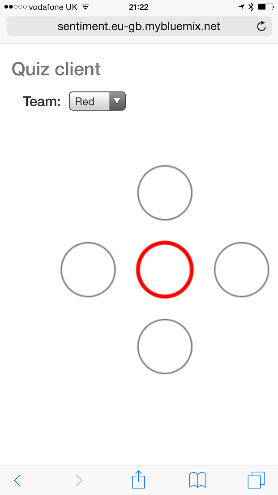

Quad-play quiz
==============

This is game that consists of teams of 4 people, each with a smart-phone webApp (client.html) and master console app (master.html). The teams attempt to answer multiple-choice questions with answers a,b,c,d. The twist is: The teams must work in silence, and they choose the answer using the joystick on the smartphone app. It is the aggregate of the 4 players that is shown on the master console.

The client app has a joystick that allows the user to move towards one of 4 positions. 



The console displays the aggregate of the 4 positions for each team. Only when all 4 players select the same choice is that choice activated. The choice (a,b,c or d) is coloured based on the first team to land on that choice.


The client app sends events to the console based on the following message structure:

```
{
"team": "Red",                          //The colour of the team
"id": 0.124342,							//a random number between 0 and 1, uniquely representing a player
"x": 100,								//The x coordinate for this player (between -100 and 100)
"y": -100								//The y coordinate for this player (between -100 and 100)
}
```

The client and console are connected via a service runing at `http://sentiment.eu-gb.mybluemix.net/`
The client sends events to a `HTTP GET` at `http://sentiment.eu-gb.mybluemix.net/answer` which then gets relayed to a web-socket
The console connects to the web-socket at `ws://sentiment.eu-gb.mybluemix.net/ws/answers` to receive a stream of events.

The server merely forwards the events from the clients to the web-socket. It holds no state and performs no other processing.


The server has a test mode where it continuously sends out test events to the web-socket.


